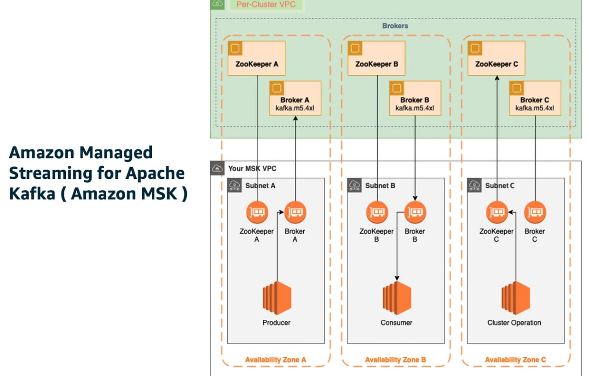
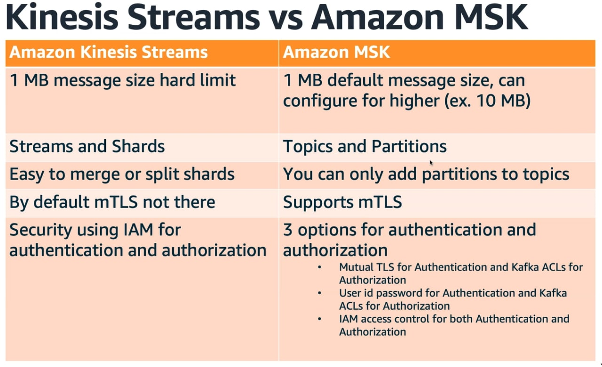

# AWS Data Analytics Specialty

* [AWS practical workshops](https://workshops.aws/)
* [AWS Partner practice exams](https://explore.skillbuilder.aws/learn/course/12472/aws-certified-data-analytics-specialty-official-practice-question-set-das-c01-english)
* [Official AWS exam guide](https://d1.awsstatic.com/training-and-certification/docs-data-analytics-specialty/AWS-Certified-Data-Analytics-Specialty_Exam-Guide.pdf)
* [Official AWS exam sample questions](https://d1.awsstatic.com/training-and-certification/docs-data-analytics-specialty/AWS-Certified-Data-Analytics-Specialty_Sample-Questions.pdf)
* [Tutorialsdojo AWS Analytics cheatsheets](https://tutorialsdojo.com/aws-cheat-sheets-analytics-services/)
* [Tutorialsdojo exam study path](https://tutorialsdojo.com/aws-certified-data-analytics-specialty-exam-guide-study-path-das-c01-das-c02/) #TODO

- [AWS Data Analytics Specialty](#aws-data-analytics-specialty)
  - [1. Data collection](#1-data-collection)
    - [1.1 Kinesis](#11-kinesis)
      - [1.1.1 Data stream](#111-data-stream)
      - [1.1.2 Kinesis Data Firehose](#112-kinesis-data-firehose)
      - [1.1.3 Firehose lab](#113-firehose-lab)
    - [1.2 SQS](#12-sqs)
    - [1.3 IoT](#13-iot)
    - [1.4 Data migration](#14-data-migration)
    - [1.5 MSK](#15-msk)
  - [2. Storage](#2-storage)
    - [2.1 S3](#21-s3)
    - [2.2 DynamoDB](#22-dynamodb)
  - [3. Processing](#3-processing)
    - [3.1 Athena](#31-athena)
    - [3.2 Glue](#32-glue)
    - [3.3 lake formation](#33-lake-formation)
    - [3.4 EMR](#34-emr)
    - [3.5 Redshift](#35-redshift)
  - [4. Analysis](#4-analysis)
    - [X.X Data pipeline](#xx-data-pipeline)


To compress json data in s3, use parquet or ORC format. max recommended file size for parquet is 250MB. merging small parquet files into one big parquet file improved performance, because you only open the file once. good practice to have less, bigger parquet files.

## 1. Data collection

### 1.1 Kinesis

* [Datalake workshop](https://catalog.us-east-1.prod.workshops.aws/workshops/c5661636-bfc3-4771-be38-a4072661bfda/en-US)

Streaming service:

The source (mobile, metering, click streams, sensors, logs...) send to data stream producers, which can be SDK, kinesis producer library, kinesis agent, 3rd part libraries like spark, log4j, kafka etc.

Kinesis types:

* **Kinesis Stream**: is real-time, 200ms latency. provides storage. good for low-latency reqs
* **Kinesis Firehose**: near real-time, good to just *ingest*/collect data for instance: iot, clickstream analytics, log analytics, security monitoring
  * Easiest way to dump streaming data into aws
  * Provides no storage
  * Minimum latency 60s, max size 1KB (#TODO check this)
  * built-in integration with s3 and other services
  * built-in lambda capability for data transform
* **Kinesis data analytics**: real-time analytics on the streaming data. not ingesting, but analytics
  * SQL: query and analyze streaming data
  * Apache Flink: stateful stream processing
* **Video streams**: stream videos inside aws

Stream workflow:

1. Ingest stream
2. Store stream
3. Process stream
4. Send to final storage
  * S3: buffer size range is from 1MB to 128MB. buffer interval is from 60s to 90s. firehose can raise buffer size dynamically. data delivery failures, auto retries up to 24h
    * By default, firehose-s3 default prefix is already based on year,months,day,hour. if we have many devices, we want to use custom prefix based on device and date (in our example, once a day)
  * Elasticsearch: same as for s3. custom retry duration up to 7200s, moves skipped files to s3 and provides a manifest file for manual entry
  * Redshift, depends on redshift to finish the COPY command. firehose issues a new copy command automatically. for data delivery failures, same as elasticsearch

#### 1.1.1 Data stream


A stream is an ordered (fifo) stream of data, composed of shards, in which each record is uniquely identifiable.

* Production
  * Producers can be apps, clients, sdks, kinesis agent
  * A record is made of a partition key and the data blob (up to 1mb). the pk determines which shard the value goes to.
  * A stream can manage up to 1MB/s/shard or 1kmsg/s/shard for production
* Consumption
  * Consumers can be apps (kcl (kinesis client library), sdk), lambda, kinesis data firehose, kinesis data analytics
  * The record going to consumers has pk, sequence number (where it was in the shard, data blob)
  * Consumption mode: 2MB/s/shard shared for all consumers, or in enhanced mode, 2MB/s/shard/consumer

Retention can be between 1-365 days. You can reprocess data. Once data is inserted into kinesis, can't be deleted (immutable). Data that shares the same partition goes to the same shard (ordered).

Capacity mode:

* Privisoned mode
  * Choose number of shard provisioned, scale manually or with API
  * Each shard gets 1MB/s in, or 1k records/s
  * Each shard gets 2MB/s out (classic or enhanced fan-out consumer)
  * You pay per shard provisioned per hour
* On-demand mode
  * No need to provision or manage capacity
  * Default capacity provisioned: 4MB/s or 4k records/s
  * Scales automatically based on observed throughput peak during the last 30 days
  * Pay per stream per hour and data in/out per gb

> Producers

* SDK
  * Use case: low throughput, hig latency, simple API, Lambda
  * PutRecord: for one
  * PutRecords: for many, uses batching, increases throughput, fewer HTTP requests
* KPL (kinesis producer library)
  * C++/Java library
  * Use case: high performance, long-running projects. Automated and configurable retry mechanism
  * Not suitable for apps that cannot handle the delay caused by the caching aggregation. if so, then use SDK
  * Sync and async API (better performance with async)
  * **Compression can be implemented, but by the user**
  * Batching enabled by default, it increases throughput and decreases cost
    * Aggregation puts several records together (but <1MB), increases latency, but increases efficiency
* Kinesis Agent
  * Installed agent in your app, Java based, built on top of KPL, monitors log files and sends them to data streams
  * Writes from multiple dirs and writes to multipls streams

Network timeouts might create duplicate records, that records are written twice, and they will get unique sequence id. To fix it, embed unique record ID in the data to de-duplicate on the consumer side.

> Consumers

* SDK
  * GetRecords: consumers poll records from a specific shard. Each shard has 2MB total aggregate throughput
    * Records up to 10MB data, then throttle for 5s, then again. or up to 10k records
    * Max 5 GetRecords API calls/s/shard = **200ms latency** (standard consumer)
    * If 5 consumer apps consume from same shard, every consumer can poll once a second and receive less than 400kb/s. enhanced fanout solves this problem
    * The stream has limits about how many MB/s, and how many records/s per shard. Example: the stream can generate 2MB/s, or 5reads/s per shard. If we have 5 consumers, then each consumers has 500kb/s read capacity.
    * For standard consumer, average latency is 200ms. With **enhanced fanout**, you get a dedicated throughput of up to 2MB of data/s/shard/consumer and average latency of 70ms.
      * EFO works with KCL and Lambda
      * Consumer doe sSubscribeToShard(), subscriber method, and then immediately the shard starts sending data immediately
* KCL (Kinesis client library)
  * Java-first, but exists for other languages
  * read records from Kinesis produced by KPL
  * Uses DynamoDB for coordination and checkpointing. If throughput is low, DynamoDB is underprovisioned
  * Already has the logic for parent-first-reading after resharding
* Connector library
  * older Java library, runs on EC2
  * writes data to s3, dynamodb, redshift, elasticsearch
  * for some targets, Firehose has replaced Connector. for others, Lambda
* Lambda
  * it can de-aggregate from KPL
  * can be used to run lightweight ETL to s3, dynamodb, redshift, elasticsearch

The user has to design a partition key and throughput, according to that shards get allocated. A bad partition key would mean that certain shards are overloaded or hot.

Consumer retries can make the app read the same data twice. This can happen when:

* A worker terminates unexpectedly
* Worker instances are added or removed
* Shards are merged or split
* The app is deployed

To fix it, make your consumer app idempotent (that there's no side effects for reading the same data twice), and that try to handle duplicates in the final destination.

> Resharding

After a reshard, you can read from child shards. But data you haven't read might still be in the parent. If you start reading the child before completing reading the parent, you could read data for a particular PK out-of-order.

After reshard, configure your consumers to read entirely from the parent until there are no new records

* Adding shards
  * can be used to increase stream capacity, or to divide a hot shard (if we divide, then there's 1MB/s per shard)
  * the old shard is closed and will be deleted once data is expired
* Merging shards
  * decrease stream capacity, save costs
  * can be used to grouop two shards with low traffic
  * old shards are closed and deleted based on data expiration

To increase capacity of stream, first use KDS in on-demand mode, and then start splitting shards.

> Autoscaling

Not native to Kinesis, you can use it with *UpdateShardCount*. Can be used with Lambda.

Resharding can't be done in parallel, you have to plan capacity in advance. You can only perform one resharding operation at a time and it takes a few seconds, redoubling shard would take a lot of time. There's also a limit on how fast you can scale up and down.

> Errors and their meanings

* ProvisionedThroughputExceedException errors, partition key is well designed. Solution: increase shard (scaling), retried with backoff, make a better PK
* RecordMaxBufferTime error, increase batch efficiency by delay
* ExpiredIteratorException KCL error, increase WCU of Dynamodb

> Security

control access or auth with iam, encryption in flight using https endpoints, encryption at rest using kms. you can also implement encryption on client side. vpc endpoints are allowed, so that an ec2 instance in a private subnet can access the kinesis stream

#### 1.1.2 Kinesis Data Firehose

* Kinesis data stream can be a producer
* Can read up to 1MB, it can do data transformation with Lambda, and it will try to batch writes into the destination
* Firehose is near-real-time, min 60s latency
* All failed data, source records, transformation failures, can go to another S3 bucket
* Unlike data stream, Firehose has automatic scaling
* Pay for the amount of aata going through Firehose
* Spark/HCL cannot read from KDF, only from data stream

Destinations: S3, Redshift (first S3, then copy through S3), ElasticSearch. Also 3rd party destinations like datadog, splunk, mongodb. and also custom destinations, like http endpoint.

Firehose accumulates records in a buffer, which is flushed based on time and size rules. If size, if you make the rule of 32mb, then if that buffer size is reached, it's flushed. for time, if you set 2mins, it's flushed every 2mins. It can automatically increase the buffer size to increase throughput.

For high throughput scenarios, use buffer size limit. For low throughput, use buffer time limit

Differences with data stream

* Data stream, you have to write custom code for producer and consumer
  * Firehose: fully managed
* Data stream is real time (200ms for classic, 70ms for enhanced fanout)
  * Firehose: near real-time, min. 1min
* Data stream, you must manage scaling yourself
  * Firehose: automatic scaling
* Data stream, you get for 1-365 days
  * Firehose: no data storage
* Data stream, Lambda can be used additionally to insert data to a destination
  * firehose: serverless data transformation with lambda

#### 1.1.3 Firehose lab

> [Direct put](https://catalog.us-east-1.prod.workshops.aws/workshops/32e6bc9a-5c03-416d-be7c-4d29f40e55c4/en-US/lab-1/lab1-1-direct-put)

Create Firehose delivery stream. The source can be data stream or direct put. Create a name for the stream.

Direct PUT is a method to send data directly from the clients to Kinesis Data Firehose.

In destination, put S3 and select a bucket. In the bucket prefix box, write:

```data/webaccess/year=!{timestamp:yyyy}/month=!{timestamp:MM}/day=!{timestamp:dd}/```

In S3 bucket error output prefix, write:

```error/webaccess/!{firehose:error-output-type}/year=!{timestamp:yyyy}/month=!{timestamp:MM}/day=!{timestamp:dd}/```

In buffer interval, write 60s. This is how often data is sent. the higher interval allows more time to collect data and the size of data is bigger. lower interval, sends data more frequently.

Compression for data records can be Disabled, gzip, snappy, zip or hadoop-compatible snappy.

```python
firehose = boto3.client('firehose')
firehose.put_record(
    DeliveryStreamName="my-stream",
    Record={ 'Data': msg }
)
```

---

> [Kinesis Agent](https://catalog.us-east-1.prod.workshops.aws/workshops/32e6bc9a-5c03-416d-be7c-4d29f40e55c4/en-US/lab-1/lab1-2-agent)

Another data source:

Amazon Kinesis Agent is a standalone Java software application. The agent continuously monitors a set of files and sends new data to your Kinesis Data Firehose delivery stream. The agent handles file rotation, checkpointing, and retry upon failures. It delivers all of your data in a reliable, timely, and simple manner. It also emits Amazon CloudWatch metrics to help you better monitor and troubleshoot the streaming process.

With a python script, you can generate app logs, the Agent will constantly monitor the log and transmit new log entries to delivery stream. incoming log entries will be stored into s3.

Install kinesis agent:

```bash
sudo yum install –y aws-kinesis-agent
```

Create a config file for the Agent, get the role ARN created to allow kinesis agent access to Firehose

```aws iam get-role --role-name FH-KinesisAgentFirehoseRole | grep Arn```

Write into agent.json

```json
{
    "assumeRoleARN": "arn:aws:iam::xxxxxxxxxx:role/FH-KinesisAgentFirehoseRole",
    "flows": [{
        "filePattern": "/tmp/api.log*",
        "deliveryStream": "my-FH-Stream-Agent"
      }]
}
```

This json should be in folder: `/etc/aws-kinesis/agent.json`. Copy it there if necessary. Then run the agent:

```bash
sudo service aws-kinesis-agent start
```

In a python script in cloud9, write logs into /tmp/api.log. Run the log-generating script, which prints logs which are saved using the logging library.

In the Agent Firehose role, update trust relationship and update the ARN to: AWS": "arn:aws:iam::xxxxxxxxxxxx:role/service-role/AWSCloud9SSMAccessRole" so that we can run it from cloud9

---

> [Data stream](https://catalog.us-east-1.prod.workshops.aws/workshops/32e6bc9a-5c03-416d-be7c-4d29f40e55c4/en-US/lab-1/lab1-3-kds)

KDS is a massively scalable and durable real-time data streaming service. KDS can continuously capture gigabytes of data per second from hundreds of thousands of sources such as website clickstreams, database event streams, financial transactions, social media feeds, IT logs, and location-tracking events.

A typical use case for Firehose is to capture incoming streams of data from Kinesis Data Stream. Kinesis Data Generator can send data to Kinesis Data Stream and capture them on S3 with Firehose.

Create data stream, you can choose on-demand or provisioned capacity, and in provisioned you can choose how many shards. Then it shows you the total data stream capacity, for 1 provisioned shard, write capacity is 1MB/s and 1krecords/s and 2MB/s read capacity.

Create firehose delivery stream, source KDS, choose which KDS, destination S3, write the bucket prefix and bucket error output prefix.

In data generator we can create data. In the stack used by the workshop #TODO the cloudformation stack outputs the data generator url, user and password. There we can log in and generate data.

You can then monitor the stream in data stream and also in firehose

### 1.2 SQS


Secure, durable and available hosted queue to integrate and decouple distributed components. Can be another ingestion service

* Standard:
  * unlimited throughput
  * at-least once delivery
  * best effort ordering
* fifo:
  * high throughput upto 3k messages/s, per API method (with matching) or up to 3k API calls/s per API method (without batching)
  * Exactly once processing, no duplicates
  * First in first out messages delivery

Data retention is 3 days default, max 14 days. Low latency, <10ms on publich and receive. message size is 256kb max.

Consumers receive records from SQS, process them and delete them afterwards.

> SQS vs. kinesis

* SQS for order, image processing. good for decoupling front and backend, and it can only received by one consumer. highly scalable, data deleted after read, capable of delaying messages
* SQS max object size is 256kb (more if using extended lib), KDS is  1MB, and KDF is 128MB at destination
* Kinesis streams for fast log and data intake and processing, real-time metrics and reporting, real-time data analytics, complex stream processing. read and replays records in same order, many apps can read from the same kinesis data stream, 1MB payload, data deleted after retention period, ordering of records is preserved at shard level, provisioned vs. on-demand mode with replay capability

### 1.3 IoT

* Device gateway: entry point for IoT devices to AWS
* Message broker: pub/sub, messages published to topics, forwards messages to all the clients connected to the topic
* Thing registry: represents all connected devices represented by their ID: supports metada for each device, can group devices together
* Device shadow: JSON document to represent state of a connected thing
* Rules engine: when a rule is triggered, an action is taken e.g. write data to Kinesis, SQS or so. IAM role needed
* Greengrass: bring the compute layer to the device directly


### 1.4 Data migration

* Data migration service (DMS): to migrate on-prem or EC2 databases into aws
  * With Schema conversion tool, you can convert the db schema from one engine to another
* Storage gateway: hybrid storage that connects on-prem to AWS. ideal for backup, bursting, tiering, migration
* Data sync: 5x faster file transfers than open source tools, good for migration data into EFS or moving between cloud file systems
* S3 transfer acceleration: fast transfers in and out of s3, ideal when working with long geographic distances
* Direct connect (DX): private connection between on-prem and aws with dedicated fiber optic, no ISP provider required. increased bandwidth
  * dedicated connection: 1Gbps, until 100Gbps
  * hosted connection: 50Mbps, until 10GBps if you order from approved aws direct connect partners
* Snow family: physical pre-packaged hardware box that gets delivered to your on-prem system
  * Snowball edge: storage optimized with ec2 compute functionality. also available: compute optimized and compute optimized with GPU
    * Storage capacity: 8TB usable, migration size up to 24TB
  * Snowcone: 2GB box, lightweight device used for edge computing, storage and data transfer. use it offline or connect via internet with aws datasync to send data (agent is preinstalled in snowcone)
    * Storage capacity: 80TB usable, migration size up to petabytes
  * Snowmobile: for huge data transfers,they send a truck instead of a box
    * Storage capacity: less than 100PB, migration size up to exabytes

### 1.5 MSK

* [Kinesis & Kafka for fraud detection workshop](https://catalog.us-east-1.prod.workshops.aws/workshops/ad026e95-37fd-4605-a327-b585a53b1300/en-US)

Managed Streaming for Apache Kafka is a service that uses fully managed Apache Kafka to ingest and process streaming data in real time. It's an alternative to kinesis, default message size is 1MB but it can be configured to send larger messages, like 10MB (as opposite to kinesis)

Producers write to the cluster (you have to write code for this), then the data gets written to the topic and replicated into the other topics, and then consumers poll from topic (write code)

The MSK cluster is composed of keeper and broker, broker is where you keep partitions. in kinesis stream we have streams and shards, in kafka we have topics and partitions.





> Configuration

* Choose number of AZs, recommended 3, or 2
* Choose VPC and subnets
* Choose broker instance type, number of brokers per AZ
* Size of EBS volumes

security:

* Optional in flight encryption using TLS between brokers, and between clients and brokers
* KMS for EBS for at encryption rest
* Security groups for clients to ensure network security

Authentication and authorization:

* Mutual TLS for authentication and kafka ACL for authorization
* User id password for authe and kafka acl for autho
* iam access control for both authe and autho

Monitoring:

* Cloudwatch basic monitoring for cluster and broker
* Cludwatch enhanced monit. for broker metrics
* cloudw topic level monitoring with enhanced metrics
* open source monitoring, like prometheus
* broker log delivery to cloudwatch, s3 or kinesis data streams

Pricing:

You are charged for the following:

* Every Apache Kafka broker instance
* The amount of storage you provide in your cluster

MSK serverless: for intermittent non-constant workloads, no need to manage or scale cluster capacity. Pricing depending on cluster, partition, and storage

MSK connect (like consumer) works with other 3rd party services, we can use plugin. you can deploy any kafka connect connectors to MSK connect as plugin like S3, redshift, openserach.
SK connect workers can poll topic data from SMK cluster, and write to S3. No need to manage infrastructure.

Source connectors can be used to import data from external systems into your topics. with sink connectors, you can eport data from your topics to external systems.

amazon managed streaming for apache kafka (cluster) can only span 1 region, in several AZs.

more info: https://docs.aws.amazon.com/msk/latest/developerguide/what-is-msk.html

> MFK vs. Kinesis data streams

* KDS 1MB message size limit, MFK 1MB default but can get higher
* Data streams with shards, kafka topics with partitions
* KDS shard splitting and merging, MSK can only add partitions to a topic
* KDS TLS in-flight encryption, MSK plaintext or TLS in-flight encryption

## 2. Storage

### 2.1 S3

* S3 latency is between 100-200ms
* Min. 3.5k put/copy/post/delete
* 5.5k get/head requests per second per prefix per bucket

Prefix is the object path in s3, so we get that performance per folder

With access points, create one access point per prefix, and grant access to different IAM groups to different prefixes in S3

With S3 object Lambda, you can change the objects before it's retrieved by the caller application, without creating another object. for that, we need 1 bucket, an access point and an object lambda access point.

S3 now has strongly consistency for all operations

### 2.2 DynamoDB

* provisioned capacity: specify rcu and wcu, the throughput for reads and writes. if you go over, you can access a temporary burst capacity, but if you exceed that, you will get error "ProvisionedThroughputExceededException"
  * Burst capacity only lasts for 300s
  * This error can come from exceeding provisioned rcu and wcu, or because of hot keys (one partition key being read too many times, for popular items), hot partitions, or very large items
  * To fix: exponential backoff, distribute partition keys and if rcu is an issue, use DAX
* on-demand: automatic scaling, no capacity planning needed
* you can switch between the modes every 24h

Each partition key is limited to 10GB of data, 3k RCU and 1k WCU

* 1 wcu = 1 write/s for an item up to 1kb. for larger files, more wcu
  * ex: write 10 items/s with item size 2kb: 10 * (2kb/1kb) = 20wcu
  * ex: write 6 items/s with item size 4.5kb: ~~6 * (4.5/1) = 27wcu~~ 4.5kb gets rounded to 5, so 6*5 = 30wcu
  * ex: write 120items/min with item size 2kb: 120/60 = 2items/s * 2 = 4wcu

for reading, 2 options: strongly(2x rcu) and eventually consistency. For consistent, for every API call, we set the ConsistentRead parameter

* 1 rcu = 1 strongly consistent reads/s = 2 eventually consistent read/s for an item up to 4kb
  * ex: 10 strong reads/s, item size 4kb: 10rcu
  * ex: 16 eventual reads/s, item size 12kb: 16/2 * 12/4 = 8*3 = 24rcu
  * ex: 10 strong reads/s, item size 6kb: ~~10 * 6/4 = 10 * 0.66 = 10rcu~~ 6 gets rounded to next multiplier of 4, which is 8, so 10 * 8/4 = 20rcu

> Read operations

* GetItem returns eventual reads by default, you can use projection expression to retrieve only certain attributes.
* Query returns items based on a specific partition key
  * KeyConditionExpression, partition key and sort key
  * FilterExpression: additional filtering after the query operation (before data is returned to you). use only with non-key attributes (no hash or range attributes)
  * Returns: number of items specified on limit, or up to 1MB of data. Can paginate results
  * What can get queried? A table, a LSI or GSI
* Scan
  * Scan entire table and then filter out
  * Returns up to 1MB of data, use pagination to keep reading
  * Consumes a lot of RCU
  * For faster performance, use Parallel scan

Batch operations allow to save in latency by reducing number of API calls, operations done in parallel.

* BatchWriteItem:
  * up to 25 PutItem/DeleteItem per call
  * up to 16MB of data written
  * up to 400KB data per item
  * But not useful for update items, for that do it individually
* BatchGetItem
  * Returns items from one table or from more
  * Up to 100 items
  * Up to 16MB of data
  * Items are retrieved in parallel

A transaction is an operation to update multiple values at the same time. If one should fail, all should fail. All or nothing.

> LSI

* Alternative sort key, but must keep the same partition key as that of base table -> PK must be composite
* Up to 5 LSI per table
* Must be defined on table creation time

> GSI

* Alternative primary key from the base table (hash or hash+range)
  * PK can be simple or composite
* Used to speed up queries on non-key attributes
* Can be added/modified after table creation
* Must provision rcu and wcu for each index

**If writes are throttled in GSI, the main table will be throttled as well**

If we have a table with Users, their comments and the date. Each comment has an ID, which is the primary key. sort key is the date. if we want to find comments made by a user, we can either scan the whole table, or create a gsi with the username as partition key and date as sort key. after we have that, we can query on the gsi, by specifying the gsi name on the --index-name.

> DAX

* Fully managed, highly available in-memory cache for DynamoDB
* Microsecond latency for reads and queries
* solves the hot key problem
* 5min TTL for cache by default
* up to 10 nodes per cluster
* 3 nodes minimum in production, multi-az

dax vs. elasticache

* dax has individual objects cache for querys and scans
* elasticache stores aggregation results

> backup

* on demand: backups remain forever, even after table is deleted
  *  create full backups of your tables for long-term retention and archival for regulatory compliance needs.
* point in time recovery
  * helps to protect your DynamoDB tables from accidental write or delete operations
  * you can restore that table to any point in time during the last 35 days
  * rolling windows way, backup stays for 35 days
  * You can restore the table to the same AWS Region or to a different Region from where the backup resides. You can also exclude secondary indexes from being created on the new restored table. In addition, you can specify a different encryption mode.

if you want more control over backups, aws backups offers centralization, data protection and backup management, monitoring status of backups, verifying compliance. with aws backup we can create daily backups and store them for a month.

* Backup vault: a container that you organize your backups in. when creating a vault, a kms key is automatically created
* Backup plan: a policy expression that defines when and how you want to back up your AWS resources. The backup plan is attached to a backup vault.
* Resource assignment: defines which resources should be backed up. You can select resources by tags or by resource ARN.
* Recovery point: a snapshot/backup of a resource backed up by AWS Backup. Each recovery point can be restored with AWS Backup.

More in-depth information about DynamoDB in the [DynamoDB Lab](https://amazon-dynamodb-labs.com/hands-on-labs.html)

## 3. Processing

### 3.1 Athena

serverless, used for querying the data

can't read from glacier

Athena workgroups are used to isolate queries for teams, apps or different workloads. you can create separate workgroups for different eams, and give different permissions, enforce cost constraints. you can track query-related metrics for all workgroup queries. IAM groups cannot manage the isolation of queries and tracking query history for teams

Athena suport susing ODBC and JDBC drivers, allowing you to report and visualize all data in s3 with the tools of your choice

athena allows you to set two types of cost contorls: per-query limit and per-workgroup limit. works with SNS

### 3.2 Glue

* [Glue studio workshop](https://catalog.us-east-1.prod.workshops.aws/workshops/71b5bdcf-7eb1-4549-b851-66adc860cd04/en-US)
* [Glue workshop](https://catalog.us-east-1.prod.workshops.aws/workshops/aaaabcab-5e1e-4bff-b604-781a804763e1/en-US)

Glue ETL is for compressing, partitioning, transforming raw data into columnar (more efficient than row-based) data format.

**Serverless** discovery and definition of table definitions and schema. Central metadata repository for your datalake. Discover schemas from your unstructured data and publsish table definitions.

Goal: extract structure from unstructured data.

* S3 data lakes
* RDS
* Redshift
* Most other SQL databases

You can create custom ETL jobs (use Spark under the hood, but you don't need to manage it): trigger-driven, on a schedule, on demand...

Gloue crawler scans data in S3 and creates schema. It can run periodically. It populates the glue data catalog, stores only the table definition. once catalogued, you can treat your unstructured data as if it was structured. Using Quicksight, we can visualize data.

Glue crawler extracts partitions based on how the S3 data is organized. e.g. if you have sensor data from devices every hour, you can a) query primarily by time range? then organize your buckets as yyyy/mm/dd/device. b) you can query primarily by device, then organize bucket as device/yyy/...

Glue crawler can be used for glue data catalog or Hive metastore, not for DynamoDB, not for RDS.

Hive lets you run sql-like queries from EMR. the glue data catalog can serve as a Hive "metastore", and also conversely, you can also import a hive metastore into glue.

Glue ETL automatically generates code to transform data, in Scala or python. can be encrypted at rest or in transit. It can be event driven (by glue triggers) or ran in schedule with glue Scheduler.

It can provision additional DPUs (data processing unit) to increase performance of underlying spark jobs. you can enable job metrics to know the max. capacity in DPUs that you need

Glue ETL can: transform, clean, enrich data before doing analysis. It generated code in python/scala, and you can modify the code to tune it to your usecases. You can also provide your own code in Spark or PySpark scripts.

Target of Glue ETL can be S3, RDS, Redshift or Glue data catalog.

Glue ETL is fully managed, cost effective, pay only what you use. Jobs are run on a serverless Spark platform.

DynamicFrame is a collection of DynamicRecords, which are self-describing records with a schema. It's like a Spark DF but with more ETL stuff.

* Bundled operations: DropFields, DropNullFields to drop (null) fields, Filter (filter records, extract one part of data), Join, Map (add, delete fields),
* ML transformations: FindMatchesML: identify duplicate or matching records in your dataset, even when the records don't have a common identifier and no fields match exactly
* Automatic format conversions: csv, json, avro, parquet, orc, xml
* Anything Spark can do, Glue ETL can do, e.g. k-means
* ResolveChoice: deals with ambiguities in a DynamicFrame and returns a new one. for example, two fields in the DF with the same name
  * make_cols: creates a new column for each type, e.g. price_double (100), price_string("100")
  * cast: casts all vals to a specified type
  * make_struct: creates a structure that contains each data type
  * project: projects every type to a given type, for example project:string

---

To do modifications on the data catalog, only works if DC is in s3, in format json/csv/parquet/avro. if parquet, special code required. and nested schemas are not supported

* To update table schema, a) re-ruwn the crawler or use enableUpdateCatalog/updateBehavior from the script
* To add new partitions, a) re-run the crawler or use enableUpdateCatalog and partitionKeys options
* To create new tables, enableUpdateCatalog/updateBehavior with setCatalogInfo enabled

---

Glue development endpoints

you can develop ETL script in a notebook, create a ETL job from it using spark and glue, and create an endpoint in a VPC. To access it:

* Apache Zeppelin on local machine
* Zeppelin ontebook on ec2 (via glue console)
* Sagemaker notebook
* Terminal
* PyCharm professional edition
* Elastic IPs to access a private endpoint address

Job bookmarks persist state from the job run, and prevents reprocessing of old data. Only process new data when re-running on a schedule. Works with S3 and relational db-s via JDBC if primary keys are in sequential order, and only if data is coming as new rows, not as updating rows.

CloudWatch events: fire a Lambda/SNS notification when ETL succeeds or fails. Invoke EC2 run, send event to Kinesis, activate step function etc.

> Costs

Billed by the second for crawler and ETL jobs. First 1M objects stored and accessed are free for the glue data catalog. development endpoints for developing ETL code, like notebooks, charged by the minute.

> Anti-patterns

To use other ETL engines apart from Spark, like Hive, Pig, etc. use Data Pipeline EMR, not Glue

---

Glue ETL supports serverless streaming ETL, it can consume from kinesis or kafka, clean and transform in-flight, and store results in S3 or elsewhere. It runs on spark structured streaming.

Glue studio is a visual interface for ETL workflows. you can create DAGs for complex workflows to transform/sample/join data, to consume from s3/kinesis/kafka/jdbc, and target to s3/glue DC. Visual job dashboard shows overview, status, run times.

Glue databrew is a visual data preparation tool, UI for pre-processing large datasets. It's more specific than glue studio. it's simpler, take a data source, apply transformations, and put output in S3. No for complicated workflows, just for simple transformation. 250 ready-make transformation. It can integrate with KMS (customer master keys only), SSL in transit, IAM, CloudTrail.

visual view of the dataframe with the data sample, simple statistics.

### 3.3 lake formation

Built on top of glue, makes it easy to set up a **secure** data lake. Loads data and monitors data flows, sets up partitions, helps with encryption and managing keys, defines transformation jobs and monitors them. Helps with access control, auditing. Source can be S3, or databases on-prem too.

Lake formation doesn't cost anything, but the underlying services do: Glue, S3, etc.

Steps in lake formation:

1. IAM user for data analyst
2. create aws glue connection to your data source
3. create s3 bucket for the datalake
4. register s3 path in LK, grant permissions
5. create datbase in LK for data catalog, grant permissions
6. Use blueprint for a workflow (ie database snapshot)
7. Run workflow
8. Grant SELECT permissions to whoever needs to read it (athena, redshift spectrum etc.)

LK supports cross-account permissions, but recipient must be set up as datalake administrator. You can use aws RAM (resource access manager) for accounts external to your organization. LK doesn't support manifests in Athena or Redshift queries. to encrypt data catalogs in LK, you need IAM permissions on the KMS encryption key. Data permission can be made super specific

"Governed Tables" support ACID transactions across multiple tables. You can set up granular access control with row and cell-level security.

allows cross-account access to data catalog metadata and underlying data. Large orgas use many AWS accounts.. users can use glue etl jobs, to query and join table across multiple accounts and still take advantage of lake formation table-level and column-level data protections. you can share data catalogs with other accounts

### 3.4 EMR

* [EMR developer experience workshop](https://catalog.us-east-1.prod.workshops.aws/workshops/3c29bc13-0f30-42f7-9f97-4ce8e2ef9b17/en-US)

Elastic MapReduce. Managed Hadoop framework on EC2 instances. Includes Spark, HBase, Presto, Flink, Hive etc. You can get involved with Spark much deeper than you can with Glue. in EMR Notebooks you can use your own code to interact with the clusters.

EMR cluster:

* Master node: leader node, manages cluster
  * Tracks status of tasks, monitors cluster health
  * Single EC" instance
* Core node: runs tasks and hosts HDFS data
  * Can be scaled up and down, but with some risk
  * Multi-node clusters have at least one core node
* Task node: runs tasks, does not store data
  * Optional node in the cluster
  * No risk of data loss when removing
  * Good use of spot instances

---

* Transient cluster: will terminate once all steps are complete
  * Load data, process, store. then shut down. saves money
* Long-running clusters must be manually terminated
  * Cluster becomes a data warehouse with periodic processing on large datasets
  * Can spin up task nodes using spot instances for temporary capacity
  * can use reserved instances on long-running clusters to save money
  * Has termination protection on by default, auto-termination off

Cluster frameworks and apps are specified at cluster launch. You can connect to master node to run jobs directly.

The EMR instances run on EC2, AWS Data Pipeline can be used to schedule and start clusters.

> Storage options in EMR

* Storage is done in HDFS (hadoop distributed file system). multiple copies are stored across cluster instances for redundancy. HDFS are ephemeral, data is lost when cluster is terminated. It's useful for caching intermediate results with significant random I/O.
* By using EMRFS, you can access S3 as if it were HDFS, allows persistent storage after cluster termination. S3 is now since 2021 strongly consistent
* You can use local filesystem for femporary data like buffers or caches
* EBS for HDFS is possible, but ephemeral. EBS volumes can only be attached when launching a cluster. if you manually detach an EBS volume, EMR treats it as a failure and replaces it.

> EMR features

* Pricing: charged by the hour + EC2 charges
* Provisions new nodes if a core node fails
* Can add and remove task nodes on the fly
* Can add and remove core nodes, but with the risk of data loss
* Can resize a running cluster's core nodes, which increases both processing and HDFS capacity

> Scaling

EMR provides managed scaling, supports scaling in instance groups and instance fleets. Scales spot, on-demand and instances in a savings plan. Available for Spark, Hive, YARN.

* Scale-up strategy: first add core nodes, then task nodes, up to max units specified
* Scale-down strategy: first remove task nodes, then core nodes, no further than min constraints
* spot nodes always removed before on-demand nodes

> Security

EMRFS has S3 encryption, TLS in transit between EMR nodes and S3, also local disk encryption, spark communication between drivers & executors is encrypted, hive communication between Glue Metastore and EMR uses TLS

> Hadoop

* MapRedice: framework for distributed data processing, maps data to key-value pairs. Reduces intermediate results to final output. Supplanted by Spark
* YARN: Yet Another Resource Negotiator: manages cluster resources for data processing frameworks
* HDFS: Hadoop distributed file system: distributes data blocks across cluster in a redundant manner. Ephemeral in EMR.

> EMR serverless

Let EMR choose how many worker nodes it needs, they are provisioned as needed, automatically.

* Choose EMR release and runtime (spark, hive, presto)
* Submit queries/scripts via job run requests
* Underlying capacity managed by EMR
  * But you can specify default worker sizes and pre-initialized capacity
  * EMR computes resources needed for jobs and schedules workers accordingly
  * All within one region, across many AZs

To use EMR serverless:

1. IAM user
2. Use aws cli for steup
3. Set up job execution role, allow emr-serverless service, s3 access, glue access, kms keys
4. Create EMR serverless app
5. Add job (e.g. spark script, hive query) within this app
6. Obtain outputs and logs

EMR serverless app lifecycle: creating, created. starting, started. stopping, stopped. terminated. To go to the next step, API calls need to be made

EMR_S has pre-initialized capacity, spark adds 10% overhead to memory requested for drivers and executors. Be sure that initial capacity is at least 10% more than requested by the job.

> Spark

Distributed processing framework for big data

* Has in-memory caching, optimized query execution
* Supports Java, Scala, Python and R
* Supports code reuse across
  * Batch processing
  * Interactive queries (spark sql)
  * Real-time analytics
  * ML (MLlib)
  * Graph processing
* Spark streaming is integrated with kinesis, kafka, on EMR
* Spark is NOT meant for OLTP (not for thousands of transactions per second), it's for OLAP (longer-live queries that take longer), for analysis

Spark apps are run as independent processes on a cluster. SparkContext (driver program) coordinates them and uses Cluster manager. It sends app code and tasks to executors, which run computations and store data.

sparksql is distributed query engine for very fast queries, like jdbc, odbc, json, hdfs, parquet, etc. it gives a sql type interface on top of data

### 3.5 Redshift

Redshift spectrum can query big filesize data in s3, serverless like athena.

store files in s3 (cost effective), analyze using redshift (cheaper than Athena)


## 4. Analysis

### X.X Data pipeline

Managed ETL service for scheduling regular data movement and processing. Integrated with on-prem and cloud.

dependency of tasks, waits for the previous tasks.

A pipeline definition specifies the business logic of your data management. From the definition, DP determines the tasks, schedules them and assigns them to task runners.

A pipeline schedules and runs tasks by creating EC2 instances to perform the defined work activities. Task Runner polls for tasks and then performs those tasks. For example, Task Runner could copy log files to S3 and launch EMR clusters. Task Runner is installed and runs automatically on resources created by your pipeline definitions. You can write a custom task runner application, or you can use the Task Runner application that is provided by Data Pipeline.

If a task is not completed successfully, Data Pipeline retries the task according to your instructions and, if necessary, reassigns it to another task runner. If the task fails repeatedly, you can configure the pipeline to notify you.


