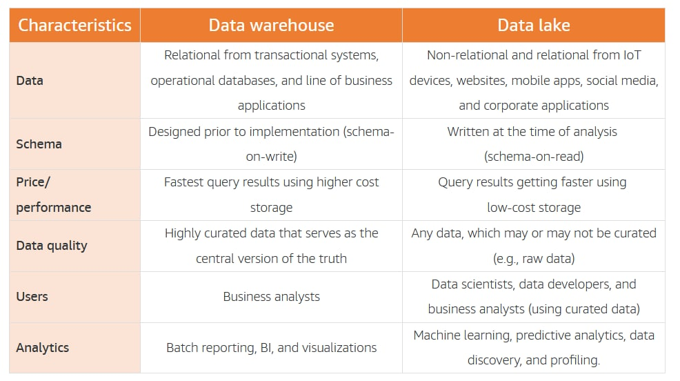
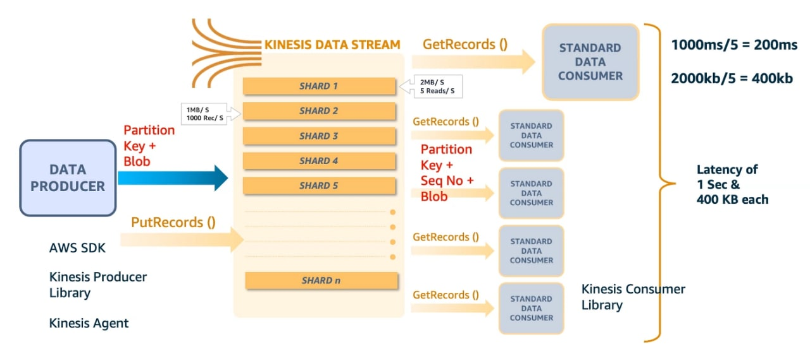
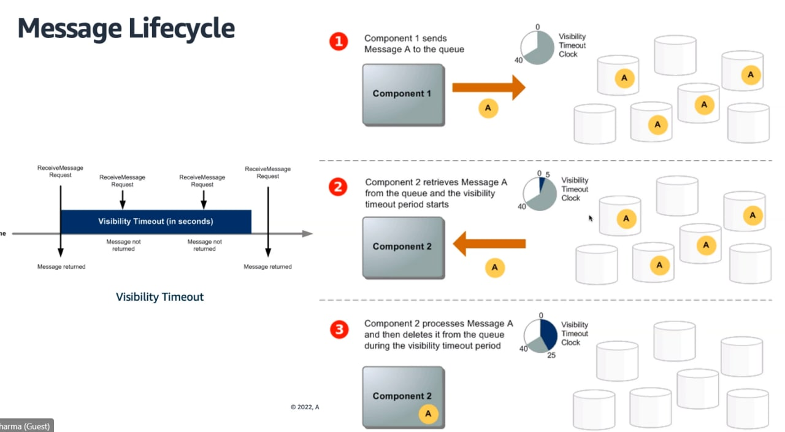
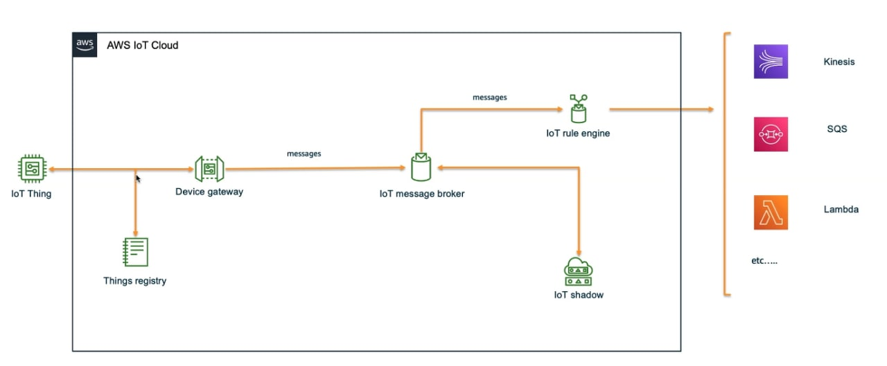
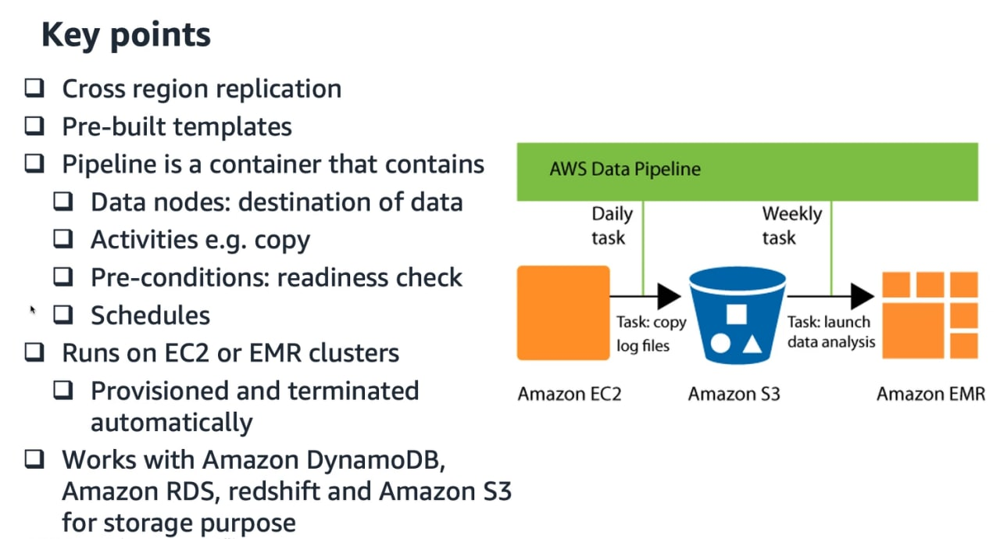

# AWS Data Analytics Specialty

* [AWS practical workshops](https://workshops.aws/)
* [AWS Partner practice exams](https://explore.skillbuilder.aws/learn/course/12472/aws-certified-data-analytics-specialty-official-practice-question-set-das-c01-english)
* [Official AWS exam guide](https://d1.awsstatic.com/training-and-certification/docs-data-analytics-specialty/AWS-Certified-Data-Analytics-Specialty_Exam-Guide.pdf)
* [Official AWS exam sample questions](https://d1.awsstatic.com/training-and-certification/docs-data-analytics-specialty/AWS-Certified-Data-Analytics-Specialty_Sample-Questions.pdf)
* [Tutorialsdojo AWS Analytics cheatsheets](https://tutorialsdojo.com/aws-cheat-sheets-analytics-services/)
* [Tutorialsdojo exam study path](https://tutorialsdojo.com/aws-certified-data-analytics-specialty-exam-guide-study-path-das-c01-das-c02/) #TODO

- [AWS Data Analytics Specialty](#aws-data-analytics-specialty)
  - [1. Data collection](#1-data-collection)
    - [1.1 Kinesis](#11-kinesis)
      - [1.1.1 Data stream](#111-data-stream)
      - [1.1.2 Kinesis Data Firehose](#112-kinesis-data-firehose)
    - [1.2 SQS](#12-sqs)
    - [1.3 IoT](#13-iot)
    - [1.4 Data migration](#14-data-migration)
    - [1.5 MSK](#15-msk)
  - [2. Storage](#2-storage)
    - [2.1 File formats](#21-file-formats)
    - [2.2 S3](#22-s3)
    - [2.3 DynamoDB](#23-dynamodb)
  - [3. Processing](#3-processing)
    - [3.1 Glue](#31-glue)
    - [3.2 Lake formation](#32-lake-formation)
    - [3.3 EMR](#33-emr)
    - [3.4 Data pipeline](#34-data-pipeline)
  - [4. Analysis](#4-analysis)
    - [4.1 Kinesis data analytics (KDA)](#41-kinesis-data-analytics-kda)
    - [4.2 Opensearch](#42-opensearch)
    - [4.3 Athena](#43-athena)
    - [4.4 Redshift](#44-redshift)
  - [5. Visualization](#5-visualization)
    - [5.1 Quicksight](#51-quicksight)
  - [6 Security](#6-security)
    - [6.1 KMS](#61-kms)
    - [6.2 CloudHSM](#62-cloudhsm)
    - [6.3 STS](#63-sts)

## 1. Data collection

### 1.1 Kinesis

* [Datalake workshop](https://catalog.us-east-1.prod.workshops.aws/workshops/c5661636-bfc3-4771-be38-a4072661bfda/en-US)

Streaming service. Kinesis types:

* **Kinesis Stream**: is real-time, 200ms latency. provides storage. good for low-latency reqs
* **Kinesis Firehose**: near real-time, no storage good for: iot, clickstream analytics, log analytics, security monitoring
  * Easiest way to dump streaming data into aws
  * Minimum latency 60s, max size 1KB
  * built-in integration with s3 and other services
  * built-in lambda capability for data transform
* **Kinesis data analytics**: real-time analytics on the streaming data
  * SQL: query and analyze streaming data
  * Apache Flink: stateful stream processing, supports Java and Scala
* **Video streams**: stream videos inside aws

#### 1.1.1 Data stream

A stream is an ordered (fifo) stream of data, composed of shards, in which each record is uniquely identifiable. A record is made of a partition key and the data blob (up to 1mb). the partition key determines which shard the value goes to. when in the shard, a sequence number is added (where it was in the shard).

The user has to design a partition key and throughput, according to that shards get allocated. A bad partition key -> hot shards.

Types of setup:

* Standard consumer
  * Avg latency 200ms
  * Throughput 2MB/s/shard shared for all consumers
* Enhanced fan-out
  * Avg latency 70ms
  * Dedicated throughput of up to 2MB of data/s/shard/consumer

Retention can be between 1-365 days. You can reprocess data. Once data is inserted into kinesis, can't be deleted (immutable). Data that shares the same partition goes to the same shard (ordered).

Capacity mode:

* Privisoned mode
  * Choose number of shard provisioned, scale manually or with API
  * Each shard gets 1MB/s in, or 1k records/s
  * Each shard gets 2MB/s out (classic or enhanced fan-out consumer)
  * You pay per shard provisioned per hour
* On-demand mode
  * No need to provision or manage capacity
  * Default capacity provisioned: 4MB/s or 4k records/s
  * Scales automatically based on observed throughput peak during the last 30 days
  * Pay per stream per hour and data in/out per gb

> Producers

* SDK
  * Use case: low throughput, hig latency, simple API, Lambda
  * PutRecord: for one, PutRecords: for many, uses batching, increases throughput, fewer HTTP requests
* KPL (kinesis producer library)
  * C++/Java library
  * Use case: high performance, long-running projects. Automated and configurable retry mechanism
  * Adds a delay of up to RecordMaxBufferedTime. Larger values of this variable result in higher packing efficiencies and better performance. Apps that cannot tolerate this additional delay need to use the SDK directly
  * Sync and async API (better performance with async)
  * Compression can be implemented, but by the user
  * Batching enabled by default, it increases throughput and decreases cost
    * Aggregation puts several records together (but <1MB), increases latency, but increases efficiency
* Kinesis Agent
  * Java based agent that can be installed in the app, built on top of KPL, monitors log files and sends them to data streams
  * But for EC2, no need for agent you can use cloudwatch logs
  * Writes from multiple dirs and writes to multipls streams

> Consumers

* SDK:
  * Records up to 10MB data or up to 10k records, then throttle for 5s, then again
  * Max 5 GetRecords API calls/s/shard because of the 200ms latency
  * The stream has limits about how many MB/s, and how many records/s per shard. Example: the stream can generate 2MB/s, or 5reads/s per shard. If we have 5 consumers, then each consumers has 400kb/s read capacity
* KCL (Kinesis client library)
  * Java-first, but exists for other languages
  * read records from Kinesis produced by KPL
  * Uses DynamoDB for coordination and checkpointing. If throughput is low, DynamoDB is underprovisioned
  * Already has the logic for parent-first-reading after resharding
* Lambda
  * it can de-aggregate from KPL
  * can be used to store data in s3, dynamodb or to run lightweight ETL to Redshift, Opensearch
* **KDS cannot deliver data directly to S3**

Double data issues:

* Reading same data twice can happen if consumers retry. To fix it, make your consumer app idempotent (that there's no side effects for reading the same data twice), and that try to handle duplicates in the final destination
* Writing same data twice issue: network timeouts might create duplicate records, and they will get unique sequence id even though it's the same data. To fix it, embed unique record ID in the data to de-duplicate on the consumer side

If a record arrives late to the app during stream processing, it's written into the error stream.

> Resharding

After reshard, configure your consumers to read entirely from the parent until there are no new records to avoid reading data for a particular PK out-of-order

* Adding shards
  * more stream capacity, more costs
  * can be used to divide a hot shard (if we divide, then there's 1MB/s per shard)
* Merging shards
  * less stream capacity, less costs
  * can be used to group two shards with low traffic

To increase capacity of stream, first use KDS in on-demand mode, and then start splitting shards.

> Autoscaling

Not native to Kinesis, you can use it with *UpdateShardCount*

Resharding can't be done in parallel, you have to plan capacity in advance. You can only perform one resharding operation at a time and it takes a few seconds, redoubling shard would take a lot of time. There's also a limit on how fast you can scale up and down.

> Errors and their meanings

* ProvisionedThroughputExceededException errors: increase shards, retried with backoff, make a better PK, move to enhanced fan-out
  * Same error name for DynamoDB, in this case increase WCU
* RecordMaxBufferTime error, increase batch efficiency by delay
* ExpiredIteratorException KCL error, increase WCU of Dynamodb

If bad performance on write, use random partition keys, and update shard count. retry and exponential backoff won't help.

> Security

* encryption in flight using https endpoints
* encryption at rest using kms
* encryption on client side can be implemented
* vpc endpoints are allowed, so that an ec2 instance in a private subnet can access the kinesis stream

#### 1.1.2 Kinesis Data Firehose

* Firehose is near-real-time, min 60s latency
* Can read up to 1MB
* All failed data, source records, transformation failures, can go to another S3 bucket

Producers:

* Kinesis data stream

Destinations

* S3
  * buffer size range is from 1MB to 128MB. buffer interval is from 60s to 90s. firehose can raise buffer size dynamically. data delivery failures, auto retries up to 24h
  * By default, firehose-s3 default prefix is already based on year,months,day,hour. if we have many devices, we want to use custom prefix based on device and date (in our example, once a day)
  * If the queries are limited to one day's logs, rotate directories daily
* Redshift (first S3, then copy through S3)
* OpenSearch
* Also 3rd party destinations like datadog, splunk, mongodb
* also custom destinations, like http endpoint
* **Lambda is not a possible destination**

Firehose accumulates records in a buffer, which is flushed based on time and size rules. If size, if you make the rule of 32mb, then if that buffer size is reached, it's flushed. for time, if you set 2mins, it's flushed every 2mins. It can automatically increase the buffer size to increase throughput. For high throughput scenarios, use buffer size limit. For low throughput, use buffer time limit.

| Stream                                        | Firehose                                                 |
| --------------------------------------------- | -------------------------------------------------------- |
| Managed service but shards need configuration | Fully managed                                            |
| Real-time                                     | Near real-time                                           |
| 200ms latency for normal, 70ms for enhanced   | min buffer time 60s                                      |
| Max data blob: 1MB                            | Max data blob: 1KB                                       |
| Data retention from 1 to 35 days              | No data retention                                        |
| Manual scaling                                | Automatic scaling                                        |
| Supports replay                               | No support for replay                                    |
| Prod: Agent, SDK, KPL                         | Prod: Stream, DirectPUT                                  |
| Cons: Analytics, Firehose, KCL, Lambda        | S3, Redshift, Opensearch, HTTP endpoint, Splunk, MongoDB |

Security:

* Server-side encryption supported with KMS
* VPC endpoints supported

### 1.2 SQS

Secure, durable and available hosted queue to integrate and decouple distributed components. Can be another ingestion service

* Standard:
  * unlimited throughput
  * at-least once delivery
  * best effort ordering
* fifo:
  * high throughput upto 3k messages/s, per API method (with matching) or up to 3k API calls/s per API method (without batching)
  * Exactly once processing, no duplicates
  * First in first out messages delivery

Data retention is 3 days default, max 14 days. Low latency, <10ms on publich and receive. message size is 256kb max. SQS only allows one consumer.

Security:

* Encryption in-flight using HTTPS
* Server-side encryption with KMS
* SQS queue access policy
* Client-side encryption is allowed, but must be implemented manually
* VPC endpoint provided through an interface

### 1.3 IoT

* Device gateway: entry point for IoT devices to AWS
* Message broker: pub/sub, messages published to topics, forwards messages to all the clients connected to the topic
* Thing registry: represents all connected devices represented by their ID: supports metada for each device, can group devices together
* Device shadow: JSON document to represent state of a connected thing
* Rules engine: when a rule is triggered, an action is taken e.g. write data to Kinesis, SQS or so. IAM role needed
* Greengrass: bring the compute layer to the device directly

Security:

* IoT policies
* IAM policies, to control access to IoT API
* Roles can be attached to rules engine to perform their actions

### 1.4 Data migration

* Data migration service (DMS): to migrate on-prem or EC2 databases into aws
  * With Schema conversion tool, you can convert the db schema from one engine to another
  * Useful when you have an on-prem db and you want a read replica, which can't be instantiated from an on-prem db. Use DMS to migrate db to RDS or similar
* Storage gateway: hybrid storage that connects on-prem to AWS. ideal for backup, bursting, tiering, migration
* Data sync: 5x faster file transfers than open source tools, good for migration data into AWS storage services or moving between cloud file systems
* Direct connect (DX): private connection between on-prem and aws with dedicated fiber optic, no ISP provider required. increased bandwidth
  * dedicated connection: 1Gbps, until 100Gbps
  * hosted connection: 50Mbps, until 10GBps if you order from approved aws direct connect partners
* Snow family: physical pre-packaged hardware box that gets delivered to your on-prem system
  * Snowball edge: storage optimized with ec2 compute functionality. also available: compute optimized and compute optimized with GPU
    * Storage capacity: 8TB usable, migration size up to 24TB
  * Snowcone: 2GB box, lightweight device used for edge computing, storage and data transfer. use it offline or connect via internet with aws datasync to send data (agent is preinstalled in snowcone)
    * Storage capacity: 80TB usable, migration size up to petabytes
  * Snowmobile: for huge data transfers,they send a truck instead of a box
    * Storage capacity: less than 100PB, migration size up to exabytes

### 1.5 MSK

* [Kinesis & Kafka for fraud detection workshop](https://catalog.us-east-1.prod.workshops.aws/workshops/ad026e95-37fd-4605-a327-b585a53b1300/en-US)

Managed Streaming for Apache Kafka is a service that uses fully managed Apache Kafka to ingest and process streaming data in real time. It can only span 1 region, in several AZs.

> MFK vs. Kinesis data streams

* KDS 1MB message size limit, MFK 1MB default but can get higher
* Data streams with shards, kafka topics with partitions
* KDS shard splitting and merging, MSK can only add partitions to a topic
* KDS TLS in-flight encryption, MSK plaintext or TLS in-flight encryption

Producers write to the cluster (you have to write code for this), then the data gets written to the topic and replicated into the other topics, and then consumers poll from topic (write code)

The MSK cluster is composed of keeper and broker, broker is where you keep partitions. in kinesis stream we have streams and shards, in kafka we have topics and partitions.

Security:

* Optional in flight encryption using TLS between brokers, and between clients and brokers
* KMS for EBS for at encryption rest
* Security groups for clients to ensure network security

Authentication and authorization:

* Mutual TLS for authentication and kafka ACL for authorization
* User id password for authe and kafka acl for autho
* iam access control for both authe and autho

Monitoring:

* Cloudwatch basic monitoring for cluster and broker
* Cludwatch enhanced monit. for broker metrics
* cloudw topic level monitoring with enhanced metrics
* open source monitoring, like prometheus
* broker log delivery to cloudwatch, s3 or kinesis data streams

Pricing:

You are charged for the following:

* Every Apache Kafka broker instance
* The amount of storage you provide in your cluster

MSK serverless: for intermittent non-constant workloads, no need to manage or scale cluster capacity. Pricing depending on cluster, partition, and storage

MSK connect (like consumer) works with other 3rd party services, we can use plugin. you can deploy any kafka connect connectors to MSK connect as plugin like S3, redshift, openserach.
SK connect workers can poll topic data from SMK cluster, and write to S3. No need to manage infrastructure.

Source connectors can be used to import data from external systems into your topics. with sink connectors, you can export data from your topics to external systems.

more info: https://docs.aws.amazon.com/msk/latest/developerguide/what-is-msk.html

## 2. Storage

### 2.1 File formats

* Parquet
  * Columnar format for Hadoop, stores nested data structures
  * compressed and splittable
  * max recommended file size: 250MB
  * good practice to have fewer, bigger parquet files. it improves performance because you only open the file once
  * Good option to compress JSON
  * Good for improving queries for tables
* ORC
  * compressed and splittable
  * Good option to compress JSON
  * columnar, good for improving queries for tables
* Avro
  * row-based format for Hadoop
  * Stores in JSON format
  * To optmize files in Hadoop, use AVRO to compress and then uncompress into 64MB chunks, which is the default HDFS chunk size

### 2.2 S3

* Latency is between 100-200ms
* Min. 3.5k put/copy/post/delete and 5.5k get/head requests per second per prefix per bucket
* now has strongly consistency for all operations
* Access point: you can create unique access control policies for each access point to easily control access to shared datasets or different prefixes in the bucket
* S3 object Lambda: you can change the objects before it's retrieved by the caller application, without creating another object. for that, we need 1 bucket, an access point and an object lambda access point
* cross region replication: to reduce latency with other regions and to keep the data as up to date as possible
* S3 and S3 one-zone IA have the same read performance
* to improve read performance, add random string prefixes to objects

> Glacier

* Glacier Select: to query cold data stored in Glacier as fast as possible. If no urgency, it's cheaper to restore data to S3 and then S3 select
* Glacier vault lock policy prevents anyone from deleting data in Glacier, and glacier vault access policy prevents access. But this only applies to data in Glacier, so if you're dealing with lifecycle rules, make sure to copy data to Glacier from day 1, and then with lifecycle rules move to IA and then delete.

### 2.3 DynamoDB

* provisioned capacity: needs to specify rcu and wcu. if you go over, you can access a temporary burst capacity, but if you exceed that, you will get "ProvisionedThroughputExceededException"
  * Burst capacity only lasts for 300s
  * This error can come from exceeding provisioned rcu and wcu, or because of hot keys (one partition key being read too many times, for popular items), hot partitions, or very large items
  * To fix: exponential backoff, distribute partition keys and if rcu is an issue, use DAX
* on-demand: automatic scaling, no capacity planning needed
* you can switch between the modes every 24h

Each partition key is limited to 10GB of data, 3k RCU and 1k WCU

* 1 wcu = 1 write/s for an item up to 1kb. for larger files, more wcu
  * ex: write 10 items/s with item size 2kb: 10 * (2kb/1kb) = 20wcu
  * ex: write 6 items/s with item size 4.5kb: ~~6 * (4.5/1) = 27wcu~~ 4.5kb gets rounded to 5, so 6*5 = 30wcu
  * ex: write 120items/min with item size 2kb: 120/60 = 2items/s * 2 = 4wcu

for reading, 2 options: strongly(2x rcu) and eventually consistency. For consistent, for every API call, we set the ConsistentRead parameter

* 1 rcu = 1 strongly consistent reads/s = 2 eventually consistent read/s for an item up to 4kb
  * ex: 10 strong reads/s, item size 4kb: 10rcu
  * ex: 16 eventual reads/s, item size 12kb: 16/2 * 12/4 = 8*3 = 24rcu
  * ex: 10 strong reads/s, item size 6kb: ~~10 * 6/4 = 10 * 0.66 = 10rcu~~ 6 gets rounded to next multiplier of 4, which is 8, so 10 * 8/4 = 20rcu

> Read operations

* GetItem returns eventual reads by default, you can use projection expression to retrieve only certain attributes
* Query returns items based on a specific partition key
  * KeyConditionExpression, partition key and sort key
  * FilterExpression: additional filtering after the query operation (before data is returned to you). use only with non-key attributes (no hash or range attributes)
  * Returns: number of items specified on limit, or up to 1MB of data. Can paginate results
  * What can get queried? A table, a LSI or GSI
* Scan
  * Scan entire table and then filter out
  * Returns up to 1MB of data, use pagination to keep reading
  * Consumes a lot of RCU
  * For faster performance, use Parallel scan

Batch operations allow to save in latency by reducing number of API calls, operations done in parallel.

* BatchWriteItem:
  * up to 25 PutItem/DeleteItem per call
  * up to 16MB of data written
  * up to 400KB data per item
  * But not useful for update items, for that do it individually
* BatchGetItem
  * Returns items from one table or from more
  * Up to 100 items
  * Up to 16MB of data
  * Items are retrieved in parallel

A transaction is an operation to update multiple values at the same time. If one should fail, all should fail. All or nothing.

> LSI

* Alternative sort key, but must keep the same partition key as that of base table -> PK must be composite
* Up to 5 LSI per table
* Must be defined on table creation time

> GSI

* Alternative primary key from the base table (hash or hash+range)
  * PK can be simple or composite
* Used to speed up queries on non-key attributes
* Can be added/modified after table creation
* Must provision rcu and wcu for each index

**If writes are throttled in GSI, the main table will be throttled as well**

If we have a table with Users, their comments and the date. Each comment has an ID, which is the primary key. sort key is the date. if we want to find comments made by a user, we can either scan the whole table, or create a gsi with the username as partition key and date as sort key. after we have that, we can query on the gsi, by specifying the gsi name on the --index-name.

> DAX

* Fully managed, highly available in-memory cache for DynamoDB
* Microsecond latency for reads and queries
* solves the hot key problem
* 5min TTL for cache by default
* up to 10 nodes per cluster
* 3 nodes minimum in production, multi-az

dax vs. elasticache

* dax has individual objects cache for querys and scans
* elasticache stores aggregation results

> backup

* on demand: backups remain forever, even after table is deleted
  *  create full backups of your tables for long-term retention and archival for regulatory compliance needs
* point in time recovery
  * helps to protect your DynamoDB tables from accidental write or delete operations
  * you can restore that table to any point in time during the last 35 days
  * rolling windows way, backup stays for 35 days
  * You can restore the table to the same AWS Region or to a different Region from where the backup resides. You can also exclude secondary indexes from being created on the new restored table. In addition, you can specify a different encryption mode.

if you want more control over backups, aws backups offers centralization, data protection and backup management, monitoring status of backups, verifying compliance. with aws backup we can create daily backups and store them for a month.

* Backup vault: a container that you organize your backups in. when creating a vault, a kms key is automatically created
* Backup plan: a policy expression that defines when and how you want to back up your AWS resources. The backup plan is attached to a backup vault.
* Resource assignment: defines which resources should be backed up. You can select resources by tags or by resource ARN.
* Recovery point: a snapshot/backup of a resource backed up by AWS Backup. Each recovery point can be restored with AWS Backup.

More in-depth information about DynamoDB in the [DynamoDB Lab](https://amazon-dynamodb-labs.com/hands-on-labs.html)

## 3. Processing

### 3.1 Glue

* [AWS documentation](https://docs.aws.amazon.com/glue/index.html)
* [Glue studio workshop](https://catalog.us-east-1.prod.workshops.aws/workshops/71b5bdcf-7eb1-4549-b851-66adc860cd04/en-US)
* [Glue workshop](https://catalog.us-east-1.prod.workshops.aws/workshops/aaaabcab-5e1e-4bff-b604-781a804763e1/en-US)

Glue is a serverless service that discovers and connects to diverse data sources (S3 data lakes, RDS, Redshift, most othe SQL databases) and manage your data in a centralized *data catalog* or Hive metastore, which is a persistent metadata store composed of many tables. You can visually create, run, and monitor ETL pipelines to load data into your data lakes. Also, you can immediately search and query cataloged data using Amazon Athena, Amazon EMR, and Amazon Redshift Spectrum.

Hive is a service for running sql-like queries from EMR. the Data catalog can serve as a Hive metastore, and also, you can import a hive metastore into glue.

Only 1 data catalog per region allowed.

> Glue crawler

Glue crawler is a program that populate the AWS Glue Data Catalog or Hive metastore with tables (cannot be used for DynamoDB, RDS). It connects to a data store, progresses through a prioritized list of classifiers to determine the schema for the data, and then creates metadata tables or updates existing tables in glue data catalog. Once catalogued, you can treat your unstructured data as if it was structured. The data is still in the data store, Glue only stores the table definition.

A classifier reads the data in a data store, if it recognizes the format of the data, it generates a schema. classifier also returns a certainty number to indicate how certain the format recognition was. glue provides built-in classifiers, but you can create custom ones too and if yo do, they are invoked first. if a classifier returns certainty=1.0, then it's 100% certain that it can create the correct schema. if no classifier returns certainty=1.0, glue uses the output of the classifier with the highest certainty, and if no classifier returns a certainty higher than 0.0, glue returns the default classification string of UNKNOWN.

Glue crawler extracts partitions based on how the S3 data is organized. e.g. if you have sensor data from devices every hour, you can a) query primarily by time range? then organize your buckets as yyyy/mm/dd/device. b) if you can query primarily by device, then organize bucket as device/yyy/... Folders where data is stored on S3 (sales/year=2019/month=1/day=1) are mapped to partitions, i.e. columns in the glue table

To do modifications on the data catalog, only works if data catalog is in s3, in format json/csv/parquet/avro. if parquet, special code required. and nested schemas are not supported

* To update table schema, a) re-run the crawler or use enableUpdateCatalog/updateBehavior from the script
* To add new partitions, a) re-run the crawler or use enableUpdateCatalog and partitionKeys options
* To create new tables, enableUpdateCatalog/updateBehavior with setCatalogInfo enabled

For tables that should support custom naming, create a new table manually.

Glue can crawl data in different regions, when you define a S3 datastore to crawl, you choose whether to crawl a path in your account or another account.

> Glue ETL

Glue ETL is a serverless simple ETL service that runs on Spark to compress, partition, convert schema, clean, enrich, find record matches, make complex transformations, before the data arrives in the target, which can be S3, RDS, Redshift or Glue Data Catalog.

It generates code in Python or Scala, and this code can be modified. Your own code in Spark or PySpark scripts can be imported. Only works with Spark, for other frameworks, use EMR

ETL jobs can be event-driven, on demand, on schedule (min every 5mins).

Glue ETL works with DPUs (data processing unit), which can be up and downscaled. With job metrics, you can know the max. capacity in DPUs and change it to a higher number if you want better performance on the ETL job.

Job bookmark persist state from the job run and prevents reprocessing of old data. Works with S3 and relational db-s via JDBC if primary keys are in sequential order, and only if data is coming as new rows, not as updating rows.

ETL capabilities:

* DropFields, DropNullFields to drop null fields, Filter (filter records, extract one part of data), Join, Map (add, delete fields),
* FindMatchesML: identify duplicate or matching records in your dataset, even when the records don't have a common identifier and no fields match exactly
* Automatic format conversions: csv, json, avro, parquet, orc, xml
* Anything Spark can do, Glue ETL can do, e.g. k-means
* ResolveChoice: deals with ambiguities in a DynamicFrame and returns a new one. for example, two fields in the DF with the same name

Glue ETL supports serverless streaming ETL, it can consume from kinesis or kafka, clean and transform in-flight, and store results in S3 or elsewhere. It runs on spark structured streaming.

> Visual UIs

Glue studio is a visual interface for ETL workflows. you can create DAGs for complex workflows to transform/sample/join data, to consume from s3/kinesis/kafka/jdbc, and target to s3/glue DC. Visual job dashboard shows overview, status, run times.

Glue databrew is a visual data preparation tool for pre-processing large datasets. It's more specific than glue studio but for simple workflows take a data source, apply a transformation from the list of 250 ready-made transformations, and put output in S3. It can integrate with KMS (customer master keys only).

> Costs

* Crawler: billed by the second
* ETL jobs: billed by the second
* Glue data catalog: first 1M objects stored and accessed are free
* development endpoints for developing ETL code, like notebooks: charged by the minute

### 3.2 Lake formation

High-level service using Glue (to know the schema) and S3 to create **secure** data lakes from S3, on-prem. Loads data and monitors data flows, sets up partitions, helps with encryption and managing keys, defines transformation jobs and monitors them. Supports cross-account access.

Steps in lake formation:

1. IAM user for data analyst
2. create aws glue connection to your data source
3. create s3 bucket for the datalake
4. register s3 path in LK, grant permissions
5. create datbase in LK for data catalog, grant permissions
6. Use blueprint for a workflow (i.e. database snapshot)
7. Run workflow
8. Grant SELECT permissions to whoever needs to read it (athena, redshift spectrum etc.)

> Security

* Supports table-level and column-level data protection
* For cross-account datalakes, recipients must be set up as datalake administrator
* You can use aws RAM (resource access manager) for accounts external to your organization
* LK doesn't support manifests in Athena or Redshift queries
* To encrypt data catalogs in LK, you need IAM permissions on the KMS encryption key
* "Governed Tables" support ACID transactions across multiple tables. You can set up granular access control with row and cell-level security

Billing: Lake formation doesn't cost anything, but the underlying services do: Glue, S3, etc.

### 3.3 EMR

* [EMR developer experience workshop](https://catalog.us-east-1.prod.workshops.aws/workshops/3c29bc13-0f30-42f7-9f97-4ce8e2ef9b17/en-US)

PaaS service for Elastic MapReduce on EC2 instances for ETL. If one node fails, provisions new nodes. When creating a cluster, specify framework (Spark, Hive...) and apps. EMR is charged by the hour plus for the additional EC2 charges.

* Master node: leader node, manages cluster
  * Tracks status of tasks, monitors cluster health
  * One single EC2 instance
  * Recommended instance type: m5.xlarge if there are less than 50 nodes
* Core node: runs tasks and stores data in HDFS
  * Can be scaled up and down to increase processing and HDFS capacity
  * Multi-node clusters have at least one core node
* Task node: runs tasks, does not store data
  * Optional node in the cluster
  * No risk of data loss when removing
  * Suitable for spot instances
    * If the app is SLA bound and the task node should complete even at on-demand price, then choose "switch to on-demand"

Cluster types:

* Transient cluster
  * Load data, process, store, then shut down. saves money
* Long-running clusters
  * Must be manually terminated. termination protection is on by default
  * Cluster becomes a data warehouse with periodic processing on large datasets
  * Can spin up task nodes using spot instances for temporary capacity
  * Can use reserved instances on long-running clusters to save money

EC2 instance types, you can only choose one for all nodes in the cluster 

* Instance groups
  * Only one AZ
  * Only one instance type per node type: master, core, task
  * autoscaling provided
* Instance fleet
  * choose AZ based on subnet
  * multiple instance types per node type
  * no autoscaling

> Storage options in EMR

* Ephemeral data storage
  * Local filesystem for buffers, caches
  * HDFS (Hadoop distributed file system): distributes data blocks across cluster for redundancy. Useful for caching intermediate results with significant random I/O
  * EBS for HDFS: EBS volumes can only be attached when launching a cluster. If you manually detach an EBS volume, EMR treats it as a failure and replaces it
* Persistent
  * EMRFS: access S3 as if it were HDFS

> Scaling

Scaling supported for spot instances, on-demand and those instances in a savings plan. Scaling is available only for Spark, Hive and Yarn (Yet Another Resource Negotiator: manages cluster resources for data processing frameworks)

* Scale-up strategy: first add core nodes, then task nodes, up to max units specified
* Scale-down strategy: first remove task nodes, then core nodes, no further than min constraints
* Spot nodes are always removed before on-demand nodes

> Security

* For authentication, Kerberos
* EC2 security groups: one for master node, another for cluster node. Security groups allow node-to-node communication
  * To get access to the cluster, add your IP as a TCP inbound rule in the cluster's security group
* Don't grant full access to S3 for the EMR cluster's service role. Instead, attach IAM roles to EMRFS and limit the EMRFS and S3 permissions attached to the service role for the cluster EC2 instances

> Encryption

* EMRFS encryption
  * S3 encryption at rest: sse-s3, sse-kms, client-side. ss3-c not supported
  * EC2 instance store encryption, NVMe or LUKS encryption
  * EBS volumes: KMS (works with root volume), LUKS (doesn't work with root module)
  * TLS in transit between EMR nodes and S3
* Spark communication between drivers & executors is encrypted
* Hive communication between Glue Metastore and EMR uses TLS

> EMR serverless

Automatic provisioning of workers, amount and scheduling for jobs. You can specify default worker sizes and pre-initialized capacity. Only one region supported. Choose EMR release and runtime (spark, hive, presto) and submit queries/scripts via job run requests.

To use EMR serverless:

1. IAM user
2. Use aws cli to set up job execution role, allow emr-serverless service, s3 access, glue access, kms keys
3. Create EMR serverless app
4. Add job (e.g. spark script, hive query) within this app
5. Obtain outputs and logs

EMR serverless app lifecycle: creating, created. starting, started. stopping, stopped. terminated.

> Spark

Distributed processing framework for big data analysis (OLAP). Allows more depth into Spark than Glue (which is serverless)

* Has in-memory caching, optimized query execution
* Supports Java, Scala, Python and R
* Supports code reuse across
  * Batch processing
  * Interactive queries (sparksql)
  * Real-time analytics
  * ML (MLlib)
  * Graph processing
* Spark streaming can consume from KDS and Kafka
* Integration with Redshift to do ETL on Redshift directly
  * Usecase: lots of data in S3, open to Redshift, start a spark cluster on EMR, use that to do ETL and write again to Redshift.

Spark apps are run as independent processes on a cluster. SparkContext (driver program) coordinates them and uses Cluster manager. It sends app code and tasks to executors, which run computations and store data. To run the spark script, do `spark-submit my_script.py`

> Apache Pig

Service to accelerate writing mappers and reducers, with Pig Latin, a scripting language with SQL-like syntax. Highly extensible with user defined functions.

> Apache HBase

NoSQL petabyte-scale database, based on Google's BigTable, on top of HDFS. It's very fast because it does processing in-memory. Hive integration. It's very similar to DynamoDB. HBase advantages:

* Efficient storage of sparse data
* Appropriate for high frequency consistent reads and writes
* High write and update throughput
* More integration with Hadoop

DynamoDB:

* Fully managed (auto-scaling)
* More integration with other AWS services, like Glue

HBase can store following data in S3: snapshots, HBase files and metadata, read-replicas

> Hive

Interactive SQL on unstructured data which is in EMR for OLAP. It uses HiveQL, similar to SQL. It's the most appropriate way for data warehouse application, more comfortable than Spark. Integration with S3 and DynamoDB. Allows custom code.

By default, Hive has a metastore info in a MySQL on the master node's filesystem. External metastores like Glue Data Catalog, RDS or Aurora offer persistence, centralization so that many users can access, and better resiliency if the cluster shuts down.

> Presto

Interactive queries at petabyte scale for OLAP. It can connect to many different big data databases and data stores (Redshift, RDS) at once, and query across them. Athena is basically serverless Presto. Custom code not allowed,

---

* EMR notebook
  * many AWS integrations: backup in S3, hosted in VPC
  * access only via AWS console
  * use your own code to interact with cluster, e.g provision cluster
* Apache Zeppelin
  * notebook to run Python on EMR data
  * Notebook notes, share with others
  * Integration with Spark
  * Execute SQL directly against SparkSQL
  * Chart and graph visualization

---

* Hue (Hadoop User Experience): graphical frontend for the cluster
* Splunk: operational tool, can be used to visualize EMR and S3 data using the EMR hadoop cluster. Makes machine data accessible, usable and valuable
* Flume: Another way to stream data into che cluster, originally made to handle log aggregation
* MXNet: deep learning on EMR
* S3DistCP: to copy large amounts of data S3 <-> HDFS
* Ganglia: to monitor cluster's performance as a whole and with individual nodes

### 3.4 Data pipeline

Managed ETL service for scheduling regular data movement and processing. Integrated with on-prem and cloud.

dependency of tasks, waits for the previous tasks. Supports cross-region pipelines

A pipeline definition specifies the business logic of your data management. From the definition, DP determines the tasks, schedules them and assigns them to task runners.

A pipeline schedules and runs tasks by creating EC2 instances to perform the defined work activities. Task Runner polls for tasks and then performs those tasks. For example, Task Runner could copy log files to S3 and launch EMR clusters. Task Runner is installed and runs automatically on resources created by your pipeline definitions. You can write a custom task runner application, or you can use the Task Runner application that is provided by Data Pipeline.

If a task is not completed successfully, Data Pipeline retries the task according to your instructions and, if necessary, reassigns it to another task runner. If the task fails repeatedly, you can configure the pipeline to notify you.

## 4. Analysis

### 4.1 Kinesis data analytics (KDA)

Serverless analytics service, pay what you consume, but not cheap. Supports schema discovery, it tries to find the data schema.

RANDOM_CUT_FOREST is a SQL function used to detect anomalies on numeric columns in data stream

Reference tables are inexpensive ways to join data for quick lookups, i.e. look up the city associated with a zip code. Mapping is stored in S3.

SQL queries in your app code execute over in-app streams, this represents unbounded data that flows continuously through your app, and to get results sets from this continuously updating input, you often bound queries using a window defined in terms of time or rows.

* Stagger window: a query that aggregates data using keyed time-based windows that open as data arrives. the keys allow for multiple overlapping windows. It's suited for data that arrives at inconsistent times. Stagger windows are the recommended way to aggregate data using time-based windows, because they reduce late our out-of-order data compared to tumbling windows
* Tumbling windows: query that aggregates data using distinct time-based windows that open and close at regular intervals, individual records might fall into separate windows, so partial results must be combined later.
* Sliding windows: a query that aggregates data continuously, using a fixed time or row count interval

KDA can deliver to KDS, KDF, Lambda, and these can write to s3 or DynamoDB.

Kinesis Data Analytics provisions capacity in the form of Kinesis Processing Units (KPU). A single KPU provides you with the memory (4 GB) and corresponding computing and networking. The default limit for KPUs for your application is eight, so the default capacity of the processing app in terms of memory is 32GB.

> Apache Flink

Apache Flink is a framework for processing data streams, can work with Java and Scala. KDA integrates Fink with AWS, making it serverless. Instead of using SQL, you can develop your own Flink app from scratch and load it into KDA via S3. Sources for Flink can be KDS, or MSK

Uses for KDA:

* Streaming ETL
* Continuous metric generation
* Responsive analytics

Security:

* IAM roles to read from data streams and write to output destination

### 4.2 Opensearch

Fully managed (no serverless, AWS manages the EC2 but you have to decide how many servers in your clusters, no autoscaling) petabyte-scale analysis and reporting, originally started as search engine. For some types of queries, OS can be faster than Spark. You can create a data pipeline with Kinesis, OS and then Dashboards for visualization. Very storage heavy

Main concepts:

* Documents: things you're looking for, can be text, can be json. Every document has a unique ID and a type
* Types: they define the scema and mapping shared by documents that represent the same sort of thing. Still in ES6, but obsolete in future versions
* Indices: an index powers search into all docs within a collection of ypes. They contain inverted indices that let you search across everything within them at once

An index is split into shard, each shard might be on a different node in a cluster. Every shard is a self-contained mini search engine. The index has two primary shards and two replicas.

* Write requests are routed to the primary shard, then replicated
* Read requests are routed to the primary or any replica

Options:

* To import data into OS: Kinesis, DynamoDB, Logstash / Beats, and Elasticsearch's native API's
* OS can scale up and down without downtime, but it has to be set up. Pay for what you use, instance-hours (charge even if idle, if not using them, just shut them down), storage, data transfer.
* You have to choose how many master nodes you want, and their instance type
  * Recommended: 3 dedicated master nodes, 3 data nodes
  * With two, you can have split-brain problem where we don't know which of the two nodes is the actual primary node. With three, the third master node decides which would be the primary
* Snapshots to S3
* Most common problem in OS is to run out of disk space, so you have to calculate the minimum storage requirement: source_data * (1 + num_replicas) * 1.45
* You have to choose the number of shards as well
  * If shard allocation across nodes is unbalanced, you can get memory pressure
  * If you see JVMMemoryPressure errors, get fewer shards by deleting old or unused indices, having too many small shards can be bad. shards should be small enough that ES can handle them but not too small that they place needless strain on the hardware

Security:

* Resource-based policies
* Identity-based policies
* IP-based policies
* Request signing
* You can put the cluster in a VPC. You have to decide that upfront, you can't move it later
  * How to access cluster if it's in VPC
    * Cognito
    * Nginx reverse proxy on EC2 forwarding to ES domain
    * SSH tunnel for port 5601
    * VPC direct connect
    * VPN
* Cognito integration for the dashboard

OS antipatterns:

* Not suitable for OLTP, for that use RDS/DynamoDB
* Not suitable for ad-hoc data querying, for that use Athena

Storage types, data can be migrated between different storage types

* Hot: used by standard data nodes, instance stores or EBS volumes. fastest performance, most expensive
* UltraWarm: uses S3 and caching, best for indices with few writes (like log data or immutable data), slower performance but much lower cost. Requires you to have a dedicated master node
* Cold: uses S3, suitable for periodic research or forensic analysis on older data, must have dedicated master and have UltraWarm enabled, not compatible with T2 or T3 instance types on data nodes.

Index state management (ISM) automates index management policies, e.g.deletes old indices after a period of time, or moves indices into read only state after some time, or move indices between storage types, reduce replica count over time, automate index snapshot. ISM policies run every 30-48 mins, random jitter to ensure they don't all run at once. It can send notification when it's done.

You can periodically roll up old data into summarized indices, maybe with old data you don't need the whole old data but just the summary. Saves storage costs.

You can transform indexes, to create a different view to analyze data differently It supports grouping and aggregation.

To ensure high availability or replicate data geographically for better latency, you can replicate indices/mappings/metadata across domains (clusters). The "follower" index (replica) pulls data from "leader" index. to enable this, we need fine-grained access control and node-to-node encryption.

Remote reindex allows copying indices (not the whole cluster) from one cluster to another on demand.

Opensearch can do the job of Kinesis analytics for log analysis and also visualization, much cheaper than Kinesis Analytics and Quicksight.

### 4.3 Athena

#TODO review https://docs.aws.amazon.com/athena/index.html

Serverless service for interactive queries for S3 (but not from Glacier), data stays in S3. It uses Presto under the hood. Supports these data formats: csv, json, ORC, parquet, avro.

Gzip, Avro are not columnar formats so not suitable for Athena

can query from redshift!

Good solution for:

* ad-hoc queries of logs for example
* querying staging data before loading to redshift
* analyze cloudtrail or similar logs in S3
* Integration with Jupyter, Zeppelin, Rstudio notebooks
* Integration with QuickSight
* Integration via ODBC/JDBC with other visualization tools

Once you have a Glue data catalog for S3 data, Athena see is automatically and make a table for it automatically.

You can organize users, teams, apps workloads into Workgroups, to isolate and control query access and track costs by Workgroup. you can create separate workgroups for different teams, and give different permissions, enforce cost constraints. you can track query-related metrics for all workgroup queries. IAM groups cannot manage the isolation of queries and tracking query history for teams.

Pricing: you're charged by TB scanned, and only successful or cancelled queries count, failed queries don't. To save money using Athena, use columnar formats like ORC, Parquet. You get less costs and better performance

athena allows you to set two types of cost controls: per-query limit and per-workgroup limit. works with SNS.

To optimize performance, have smaller number of large files than many small files. Also use partitions.

Athena provides ACID transactions, concurrent users can safely make row-level modifications. You can also recover recently deleted data with SELECT statement.

### 4.4 Redshift

two types of snapshot, automated and manual. automated takes a snapshot every 8h or following every 5gb per node of data changes. Manual snapshots can be taken at any time, and by default manual snapshots are retained indefinitely even after clutser deletion.

column level grant and revoke to help meet security and compliance requirements

Fully-managed (not serverless!) petabyte-scale data warehouse for structured data (for unstructured, use ETL on EMR), designed for online analytic processing. Designed for OLAP, not OLTP (transaction, for this use RDS or DynamoDB). It can scale up and down on demand, and has built-in replication and backups. Doesn't provide low latency.

The cluster is composed of the leader node, connecting to the client via JDBC/ODBC, and the compute nodes.

**Redshift Spectrum** can query exabytes of unstructured data in S3 without loading. It's serverless like Glue data catalog + Athena but instead of having console-based query sql engine, it looks like a table in the Redshift database. It provides limitless concurrency, horizontal scaling. Difference between Spectrum and Glue is that Redshift is thought of more for reporting and analysis, and Glue is for complex transformations. And Athena is faster and cheaper, just runs queries against S3 data.

Redshift has massively parallel processing, columnar data storage and columnar compression.

Redshift supports data lake export to S3 in Parquet format.

AQUA, accelerated query accelerator, is for apps that use S3 and Redshift. Pushes reduction and aggregation queries closer to the data, it has high-bandwidth connection to S3.

Key points:

* Automatic data replication within the cluster
* Automatic backup to S3
* Automatic async replicated to another region
* Automated snapshots
* Failed nodes or drivers are automatically replaced
* **However, Redshift is limited to one AZ**
  * To maintain a read-replica in another AZ, spin up separate clusters in 1+AZs using Kinesis to simultaneously write data into each cluster. Use Route53 to direct your analytic tools to the nearest cluster when querying your data
* Scaling is done vertically and horizontally on demand, but with downtime.
  * A new cluster is created and the old on remains availabla as read. then the CNAME flipped to new cluster (downtime), then data moved in parallel to the new cluster.

Decide how data is distributed among the nodes and the slices according to the distribution style you chose during table creation. The styles:

* Auto: the service decides based on data size
* Even: rows distributed across slices in round-robin
* Key: rows distributed based on one column
* All: entire table is copied to every node

Sort keys. Similar to indices. When storing data on disk, rows are stored in sorted order based on the column you designated as sort key. It makes for fast range queries. If you will query based on recency, then make a time-based sort key.

Importing / exporting data:

* COPY: parallel command to load files from S3/EMR/DynamoDB into Redshift
  * Try to have as few COPY commands as possible, and file sizes no more than 1GB each, ideally with compression.
  * This command adds hidden metadata columns
  * This command can also decrypt data as it's loadad from S3
  * Compression is supported to speed it up even more
  * To improve loading times, split large files into smaller chunks
  * Narrow tables (many rows, few columns), load it with one COPY transaction
* UNLOAD: unload from a table into files in S3
* INSERT: command is to move data from one table to another, data is already in Redshift
* VACUUM: recover space from deleted rows, it re-sorts rows and reclaims space

To copy a snapshot from a KMS-encrypted cluster in another region for backup, then:

1. In destination region, create KMS key
2. Specify unique name for the snapshot copy grant
3. Specify KMS key ID for which you're creating the copy grant
4. In the source region, enable copying of snapshots to the copy grant created above

With **DBLINK**, Redshift can be connected to PostgreSQL and enable copying and syning data between PostgreSQL and Redshift.

Redshift workload management: prioritize short, fast queries vs. long, slow queries. You can also create query queues.

With short query acceleration, we can prioritize short-running queries over long-running ones, by making short queries run in a dedicated space. Use this if you only have short queries, else use RWM

Redshift clusters can be resized:

* Elastic resize
  * Not always available
  * Change the node type, number of nodes, or both
  * Downtime of 10-15mins, during this cluster is read-only
* Classic resize
  * Change the node type, number of nodes, or both
  * Cluster is read-only for hours, or days
  * Use this when resizing to or from single-node cluster
  * To keep cluster available during classic resize, use snapshot, restore, resize

Security:

* Encryption at rest using KMS or an HSM device, in which case you have to establish a connection
* Encryption in-flight using the JDBC driver enabled with SSL
* When using Hardware security module, you must use client + server certificate to configure a trusted connection
  * If you migrate an unencrypted cluster to an HSM-encrypted cluster, you must create the new encrypted cluster and then move data to it
* You can define access privileges for users or groups, with grant or revoke commands in sql

Redshift serverless:

* Automatically scale and provision for your workload
* Uses ML to maintain performance across variable and sporadic workloads
* Spectrum, public endpoints not supported

To create external tables, define the structure for files and register them as tables in glue data catalog.

dense storage nodes are just HDD, no compute. for queries, use dense compute nodes

Diststyle defines the data distribution style for the whole table.

* diststyle key: rows are distributed according to the values in one column, leader node places matching values on the same node slice. good to use for the main table (trips, for a food sharing app)
* diststyle even: leader node distirbutes rows across slices in a round-robin fashion. Even distribution is appropriate when a table does not participate in joins. good for tables that change frequently
* diststyle all: a copy of the entire table is distributed to every node. ensures that every row is collocated for every join that the table participates in. this distribution is approrpiate only for relatively slow-moving tables, tables that are not updated frequently or extensively

## 5. Visualization

### 5.1 Quicksight

Serverless tool for business analysts to analzye and visualize data, perform ad-hoc analysis. Allows creating dashboards and contains limited ETL. For more ETL, use Glue/Spark. Not meant for use in the public.

Data sources: Redshift, Aurora/RDS, Athena, EC2-hosted dbs, Files (on-prem, excel, s3, but not in parquet format).

SPICE, super-fast parallel in-memory calculation engine, is used to accelerate interactive queries on large datasets. Each user gets 10GB of SPICE, it's highly available, durable, scalable to many users.

It can accelerate large queries that would time out in direct query mode (=hitting Athena directly), but big queries might still time out on spice, if it takes >30mins to import the data from Athena into Spice.

You can set up scheduled refresh of datasets, so they get updated every day for example.

Security:

* MFA
* VPC connectivity
* Row-level security
* Private VPC access

Quicksight can only access data stored in the same region as Redshift. If they're in different regions, create a new security group with an inbound rule authorizing access from the IP range of QuickSight servers in that region.

Pricing:

Enterprise is double as standard, and it's paid per user per month. Extra Spice capacity can be acquired too. Enterprise includes encryption at rest with AWS managed key and microsoft AD integration.

ML:

* Random cut forest can find anomalies, outliers in the dataset
* Random cut furest It can also do forecasting, detect seasonality and trends
* Autonarratives, adds "story of your data" to your dashboard
* Suggested insight: A new tab displays ready-to-use suggested insights

Quicksight includes ML-powered forecasting.

Quicksight Q is a tool to allow users to query with NLP, offered as add-on in some regions. To use this, you have to set up topics associated to datasets. Datasets and the fields  must be NLP-friendly.

Visualization types:

* AutoGraph: selects the visualization automatically
* Bar charts, for comparison and distribution. histogram
* Line graphs, for changes over time
* Combo chart: combination of two column charts, two line graphs or column chart + line graph
* Scatter plots: for correlation
* Heat map: like pivot tables that highlight outliers and trends
* Pie/doughnut graphs, tree maps: for aggregation, to see how much percentage each section has, like a cake
* Pivot tables: for tabular data

For public facing interactive charts and dashboards, write data into S3, enable Cloudfront, and use Highcharts or d3.js to visualize the data on the web.

S3 bucket permissions can be altered through quicksight directly, in case import into spice fails.

Quicksight supports Redshift connectivity, whether the clutser is in a VPC or not. Also if it's another account, by first providing the source's connection details.

## 6 Security

3 methods for encrypting objects in S3:

* SSE-S3: objects are encrypted using keys handled and managed by S3
  * AES-256 encryption type, must set header "x-amz-server-side-encryption": "AES256"
* SSE-KMS: keys managed by KMS
  * Advantages: user control and audit trail. Header: "x-amz-server-side-encryption": "aws:kms"
* SSE-C: client manages their own keys
  * Encryption is done in S3, but key is not stored in S3, you need encryption in transit using HTTPS
  * Encryption key must be provided in HTTP headers for every HTTP request made
* Client side encryption
  * You encrypt objects before uploading to S3, and decrypt when retrieving from S3
  * Client manages the keys and encryption cycle completely

S3 exposes HTTP endpoint, non encrypted, and HTTPS endpoint, with encryption in flight. this is recommended.

### 6.1 KMS

Manages and rotates keys, but only up to 4kb of data per call. If data is bigger, use envelope encryption. Supports symmetric and asymmetric encryption.

3 types of customer master keys (CMK)

* AWS managed CMK: free
* User keys created in KMS: $1/mo
* User keys imported: $1/mo

You also pay for API calls to KMS

S3 allows in-place encryption on the fly, other services like EBS, EFS, RDS, Elasticache, need snapshot/backup to be able to encrypt it.

Automatic key rotation is possible only for customer-managed CMK. If enabled, it rotates keys every year, old key is kept alive so you can decrypt old data. New key has the same CMK ID, only the backing key is changed.

You can also rotate keys manually, whenever you want. in this case new key has different CMK ID. Previous key is also kept alive. You should use alias to hide the change of key for the app.

### 6.2 CloudHSM

AWS provisions the hardware (HSM = hardware security module), but you have to use your own client to perform the encryption. You manage your own encryption keys entirely. Supports both symmetric and asymmetric encryption, multiAZ can be enabled.

Redshift supports CloudHSM. CloudHSM is a good option for SSE-C encryption.

### 6.3 STS

Security token service, allows to grant limited and temporary access to AWS resources. Token is valid for up to 1h

Allows cross-account access:

1. Define IAM role for another account to access
2. Define which accounts can access this role
3. use STS to retrieve credentials and assume the role that you have access to

Also supports federation, users outside of AWS get temporary role to access AWS resources: AD, SAML, SSO, Cognito

---

#TODO OLAP (analytics) vs. OLTP? OLTP for transaction, row-based
OLTP (for thousands of transactions per second), OLAP (longer-live queries that take longer), for analysis